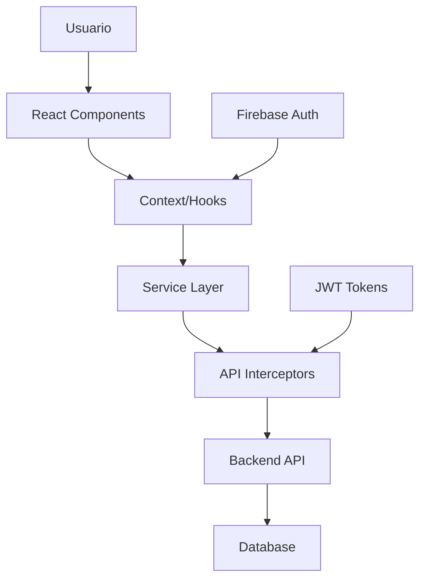

# 🏉 MVPV - Rugby MVP Voting System

<div align="center">


**Un sistema completo de votación en tiempo real para elegir al Mejor Jugador del Partido (MVP) en rugby**

[](https://reactjs.org/)
[](https://www.typescriptlang.org/)
[](https://chakra-ui.com/)
[](https://firebase.google.com/)
[](https://vitejs.dev/)

[🚀 Demo en Vivo](#-demo) • [📖 Documentación](#-características) • [🛠️ Instalación](#-instalación) • [👨‍💻 Autor](#-autor)

</div>

---

## 📋 Tabla de Contenidos

- [🎯 Acerca del Proyecto](#-acerca-del-proyecto)
- [✨ Características](#-características)
- [🛠️ Stack Tecnológico](#️-stack-tecnológico)
- [🏗️ Arquitectura](#️-arquitectura)
- [🚀 Instalación](#-instalación)
- [📱 Capturas de Pantalla](#-capturas-de-pantalla)
- [🔧 Configuración](#-configuración)
- [📚 API Documentation](#-api-documentation)
- [🤝 Contribución](#-contribución)
- [📄 Licencia](#-licencia)
- [👨‍💻 Autor](#-autor)

---

## 🎯 Acerca del Proyecto

**MVPV** es una aplicación web moderna y completa diseñada para gestionar el sistema de votación del Mejor Jugador del Partido (MVP) en partidos de rugby. La aplicación permite a los administradores gestionar jugadores y partidos, mientras que los usuarios pueden votar por su jugador favorito en tiempo real.

### 🎮 Funcionalidades Principales

- **Sistema de Autenticación Robusto**: Login/registro con JWT, refresh tokens automáticos y sesiones seguras
- **Gestión Completa de Jugadores**: CRUD completo con imágenes, posiciones y estadísticas
- **Administración de Partidos**: Crear, editar y gestionar partidos con validaciones de negocio
- **Sistema de Votación en Tiempo Real**: Votación segura con validaciones y estadísticas en vivo
- **Panel de Administración**: Interfaz intuitiva para gestión completa del sistema
- **Responsive Design**: Optimizado para dispositivos móviles y desktop
- **Seguridad Avanzada**: Protección de rutas, validación de sesiones y manejo de tokens

---

## ✨ Características

### 🔐 Autenticación y Seguridad
- **JWT Authentication** con refresh tokens automáticos
- **Firebase Integration** para autenticación social
- **Session Management** con timeout automático
- **Protected Routes** con roles de usuario (Admin/User)
- **Password Reset** con tokens seguros

### 👥 Gestión de Usuarios
- **Registro de Usuarios** con validación
- **Perfiles de Usuario** diferenciados
- **Gestión de Sesiones** avanzada
- **Recuperación de Contraseña** completa

### 🏉 Gestión de Jugadores
- **CRUD Completo** de jugadores
- **Upload de Imágenes** con optimización
- **Gestión de Posiciones** y números de camiseta
- **Sistema de Camadas** (generaciones)
- **Estados Activo/Inactivo** para jugadores

### ⚽ Gestión de Partidos
- **Creación de Partidos** con validaciones
- **Selección de Jugadores** (15-23 jugadores por partido)
- **Estados de Partido**: Programado, En Proceso, Finalizado
- **Información de Rivales** y descripciones
- **Fechas y Horarios** gestionados

### 🗳️ Sistema de Votación
- **Votación en Tiempo Real** durante partidos activos
- **Validación de Votos** (un voto por usuario por partido)
- **Estadísticas en Vivo** con porcentajes
- **Top 3 Jugadores** más votados
- **Ganador del MVP** automático
- **Tiempo Restante** para votación

### 📊 Dashboard y Estadísticas
- **Estadísticas de Votación** en tiempo real
- **Historial de Partidos** y ganadores
- **Último Ganador** destacado
- **Próximo Partido** programado
- **Total de Votos** por partido

---

## 🛠️ Stack Tecnológico

### Frontend
| Tecnología | Versión | Propósito |
|------------|---------|-----------|
| **React** | 19.1.1 | Framework principal |
| **TypeScript** | 5.8.3 | Tipado estático |
| **Chakra UI** | 3.26.0 | Sistema de diseño |
| **React Router DOM** | 7.9.0 | Enrutamiento |
| **Axios** | 1.11.0 | Cliente HTTP |
| **Framer Motion** | 12.23.12 | Animaciones |
| **React Icons** | 5.5.0 | Iconografía |

### Backend & Servicios
| Tecnología | Versión | Propósito |
|------------|---------|-----------|
| **Firebase** | 12.3.0 | Autenticación y servicios |
| **Node.js/Express** | - | API Backend |
| **JWT** | - | Autenticación |
| **MongoDB/PostgreSQL** | - | Base de datos |

### Desarrollo
| Herramienta | Versión | Propósito |
|-------------|---------|-----------|
| **Vite** | 7.1.2 | Build tool y dev server |
| **ESLint** | 9.33.0 | Linting |
| **TypeScript ESLint** | 8.39.1 | Linting TypeScript |

---

## 🏗️ Arquitectura

### 📁 Estructura del Proyecto
```
src/
├── components/          # Componentes reutilizables
│   ├── admin/          # Componentes del panel admin
│   ├── common/         # Componentes comunes
│   └── layout/         # Componentes de layout
├── contexts/           # Contextos de React
├── hooks/              # Custom hooks
├── pages/              # Páginas de la aplicación
├── services/           # Servicios de API
├── types/              # Definiciones de TypeScript
└── config/             # Configuraciones
```

### 🔄 Patrones de Diseño Implementados

- **Context API Pattern**: Para manejo de estado global
- **Custom Hooks**: Para lógica reutilizable
- **Service Layer**: Para abstracción de API
- **Protected Routes**: Para seguridad de rutas
- **Error Boundaries**: Para manejo de errores
- **Interceptor Pattern**: Para manejo de requests/responses

### 🚀 Flujo de Datos



---

## 🚀 Instalación

### Prerrequisitos
- Node.js (versión 18 o superior)
- npm o yarn
- Cuenta de Firebase

### 1. Clonar el Repositorio
```bash
git clone https://github.com/Comagol/mvpv.git
cd mvpv
```

### 2. Instalar Dependencias
```bash
npm install
# o
yarn install
```

### 3. Configurar Variables de Entorno
Crear archivo `.env` en la raíz del proyecto:
```env
# Firebase Configuration
VITE_FIREBASE_API_KEY=tu_api_key
VITE_FIREBASE_AUTH_DOMAIN=tu_dominio.firebaseapp.com
VITE_FIREBASE_PROJECT_ID=tu_project_id
VITE_FIREBASE_STORAGE_BUCKET=tu_bucket.appspot.com
VITE_FIREBASE_MESSAGING_SENDER_ID=tu_sender_id
VITE_FIREBASE_APP_ID=tu_app_id

# API Configuration
VITE_API_BASE_URL=http://localhost:5000
```

### 4. Ejecutar en Desarrollo
```bash
npm run dev
# o
yarn dev
```

### 5. Build para Producción
```bash
npm run build
# o
yarn build
```

---

## 📱 Capturas de Pantalla

### 🏠 Pantalla Principal


### 👤 Panel de Administración


### 🏉 Gestión de Partidos


### 👥 Gestión de Jugadores


---

## 🔧 Configuración

### Firebase Setup
1. Crear proyecto en [Firebase Console](https://console.firebase.google.com/)
2. Habilitar Authentication con Email/Password y Google
3. Configurar las reglas de seguridad
4. Obtener las credenciales de configuración

### API Backend
El proyecto requiere un backend API que maneje:
- Autenticación JWT
- CRUD de jugadores y partidos
- Sistema de votación
- Estadísticas en tiempo real

---

## 📚 API Documentation

### Endpoints Principales

#### Autenticación
```typescript
POST /auth/login
POST /auth/register
POST /auth/refresh-token
POST /auth/forgot-password
POST /auth/reset-password
```

#### Jugadores
```typescript
GET    /players          # Listar jugadores
POST   /players          # Crear jugador
PUT    /players/:id      # Actualizar jugador
DELETE /players/:id      # Eliminar jugador
```

#### Partidos
```typescript
GET    /matches          # Listar partidos
POST   /matches          # Crear partido
PUT    /matches/:id      # Actualizar partido
DELETE /matches/:id      # Eliminar partido
```

#### Votación
```typescript
POST   /votes            # Crear voto
GET    /votes/:matchId/stats    # Estadísticas
GET    /votes/:matchId/top3     # Top 3 jugadores
GET    /votes/:matchId/winner   # Ganador
```

---

## 🤝 Contribución

¡Las contribuciones son bienvenidas! Para contribuir:

1. **Fork** el proyecto
2. **Crea** una rama para tu feature (`git checkout -b feature/AmazingFeature`)
3. **Commit** tus cambios (`git commit -m 'Add some AmazingFeature'`)
4. **Push** a la rama (`git push origin feature/AmazingFeature`)
5. **Abre** un Pull Request

### Guías de Contribución
- Sigue las convenciones de código establecidas
- Añade tests para nuevas funcionalidades
- Actualiza la documentación si es necesario
- Asegúrate de que todos los tests pasen

---

## 📄 Licencia

Este proyecto está bajo la Licencia MIT. Ver el archivo [LICENSE](LICENSE) para más detalles.

---

## 👨‍💻 Autor

**Francisco Comabella**
- 💼 LinkedIn: [linkedin.com/in/francisco-comabella-22a61b20b](https://www.linkedin.com/in/francisco-comabella-22a61b20b/)
- 📧 Email: comabellafrancisco@gmail.com
- 🐙 GitHub: [@Comagol](https://github.com/Comagol)

---

<div align="center">

### 🌟 Si te gusta este proyecto, ¡dale una estrella! ⭐

**Desarrollado con ❤️ y mucho ☕**

[⬆️ Volver al inicio](#-mvpv---rugby-mvp-voting-system)

</div>